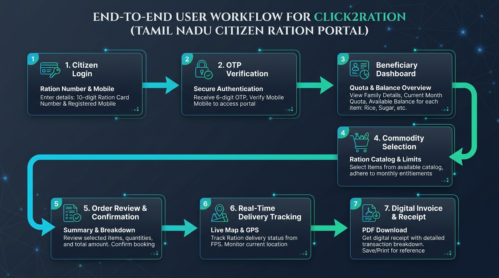

# Click2Ration — Tamil Nadu User Portal

**Click2Ration** is a modern, citizen-facing web portal built for the Government of Tamil Nadu's Public Distribution System (PDS). It digitizes the entire ration distribution workflow — from authentication to doorstep delivery — eliminating physical queues, manual record-keeping, and inefficiencies in the traditional fair-price shop model.

---

## Overview

The Tamil Nadu ration distribution system serves millions of families every month. Click2Ration bridges the gap between the government's commodity allocation infrastructure and the end beneficiary by providing a secure, intuitive, and multilingual digital interface that works across all devices.

Citizens can authenticate using their ration card number, verify their identity via OTP, browse their allocated commodities, place an order, and track delivery in real time — all from a smartphone or desktop browser.

---

## Key Features

### Authentication and Security
- Ration card number-based login with OTP verification
- Simulated SMS delivery with popup confirmation
- Session-scoped state management with no persistent sensitive data

### Citizen Dashboard
- Real-time commodity allocation overview with visual consumption meters
- Monthly quota tracking per household member
- Out-of-stock alerts with notification subscription
- Recent order history with delivery status

### Product Selection and Ordering
- Dynamic product catalog filtered by family size and allocation rules
- Quantity controls with maximum-limit enforcement
- Order confirmation screen with itemized cost breakdown

### Real-Time Delivery Tracking
- Live delivery agent simulation on an interactive Leaflet map
- Step-by-step status timeline (Order Placed → Processing → Dispatched → Out for Delivery → Delivered)
- Delivery agent card with name, contact, and ETA
- OTP-based delivery confirmation (preventing fraudulent handoffs)
- Post-delivery rating and feedback dialog

### PDF Invoice Generation
- One-click downloadable order receipt with order ID, items, quantities, and pricing
- Government header and branding using the Tamil Nadu state logo

### AI-Powered Ration Assistant (RationBot)
- Conversational chatbot for answering queries about allocations, order status, eligibility, and scheme details
- Accessible from any screen via a floating action button

### Multilingual Support
- Full interface available in English and Tamil
- Language toggle persists across the session

### Notifications
- In-app notification center for SMS-simulated messages
- Unread count badge on the notification bell
- Mark-as-read and mark-all-as-read actions

---

## Technology Stack

| Layer | Technology |
|---|---|
| Framework | React 18 with TypeScript |
| Build Tool | Vite |
| Styling | Tailwind CSS with custom design tokens |
| UI Components | shadcn/ui (Radix UI primitives) |
| State Management | React state and context (LanguageContext) |
| Data Fetching | TanStack Query (React Query) |
| Backend / Auth | Supabase |
| Real-Time Database | Firebase |
| Mapping | Leaflet + React Leaflet |
| PDF Generation | jsPDF |
| QR / Barcode | html5-qrcode |
| Forms | React Hook Form + Zod |
| Icons | Lucide React |
| Routing | React Router v6 |
| Charts | Recharts |

---

## Project Structure

```
src/
├── assets/              # Static assets (TN logo base64, etc.)
├── components/          # Feature components
│   ├── bot/             # RationBot chatbot subcomponents
│   ├── tracking/        # Delivery map, timeline, OTP, rating
│   └── ui/              # shadcn/ui component library
├── contexts/            # React context providers (LanguageContext)
├── firebase/            # Firebase configuration
├── hooks/               # Custom hooks (SMS simulation, delivery simulation)
├── integrations/        # Supabase client and type definitions
├── lib/                 # Utility functions
├── pages/               # Route-level page components
├── services/            # Service layer abstractions
├── types/               # TypeScript type definitions
└── utils/               # Helper utilities
```

---

## Getting Started

### Prerequisites

- Node.js 18 or higher
- npm or bun

### Installation

```bash
# Clone the repository
git clone https://github.com/Kishore-dev-21/C2R_User-Portal.git

# Navigate into the project directory
cd C2R_User-Portal

# Install dependencies
npm install
```

### Environment Configuration

Create a `.env` file in the root directory and supply your Supabase and Firebase credentials:

```env
VITE_SUPABASE_URL=your_supabase_project_url
VITE_SUPABASE_ANON_KEY=your_supabase_anon_key
VITE_FIREBASE_API_KEY=your_firebase_api_key
VITE_FIREBASE_AUTH_DOMAIN=your_firebase_auth_domain
VITE_FIREBASE_PROJECT_ID=your_firebase_project_id
```

### Development

```bash
npm run dev
```

The application will be available at `http://localhost:8080`.

### Production Build

```bash
npm run build
```

The compiled output will be placed in the `dist/` directory, ready for deployment to any static hosting provider (Firebase Hosting, Vercel, Netlify, etc.).

### Preview Production Build

```bash
npm run preview
```

---

## Application Flow



1. **Citizen Authentication**: Beneficiaries log in using their 10-digit Ration Card number and registered mobile number.
2. **OTP Verification**: Multi-factor authentication via 6-digit one-time password.
3. **Citizen Dashboard**: Access family member quotas, available balances, and current month entitlement statuses.
4. **Commodity Selection**: Select required commodities within allocated thresholds.
5. **Order Review & Confirmation**: Review itemized pricing and booking summary.
6. **Real-Time Delivery Tracking**: Track fair-price shop dispatch and delivery agent location on an interactive GPS map.
7. **Digital Invoice & Receipt**: Secure delivery OTP confirmation and downloadable official PDF receipt.

---

## Deployment

This project is pre-configured for **Firebase Hosting**.

```bash
# Install Firebase CLI globally if not already installed
npm install -g firebase-tools

# Authenticate with Firebase
firebase login

# Deploy to Firebase Hosting
firebase deploy
```

The `firebase.json` and `.firebaserc` files are already present in the repository.

---

## Contributing

Contributions are welcome. Please open an issue first to discuss proposed changes before submitting a pull request.

1. Fork the repository
2. Create a feature branch (`git checkout -b feature/your-feature-name`)
3. Commit your changes with a clear message
4. Push to your fork and open a pull request against `main`

---

## License

This project is developed for academic and government service demonstration purposes. All rights reserved by the contributors.

---

## Acknowledgements

- Government of Tamil Nadu — Civil Supplies and Consumer Protection Department
- All open-source library authors whose work powers this application
